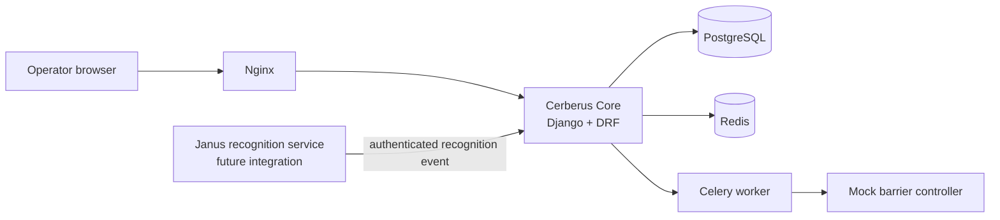
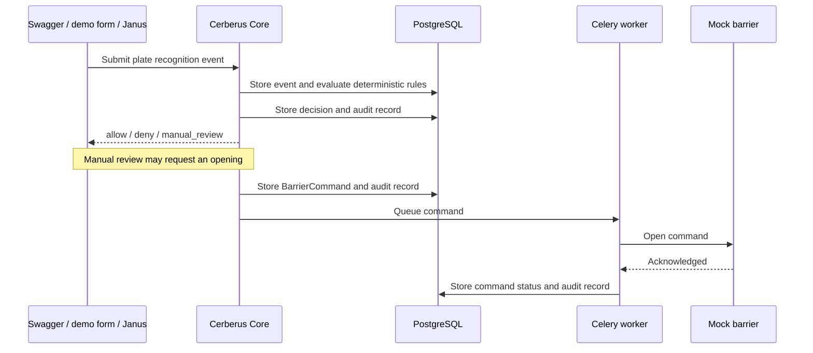

# Cerberus MVP architecture

Cerberus Core is the only component that evaluates access rules and queues barrier commands.
Janus supplies recognition data only; it never decides whether a barrier should open.

## MVP request flow

